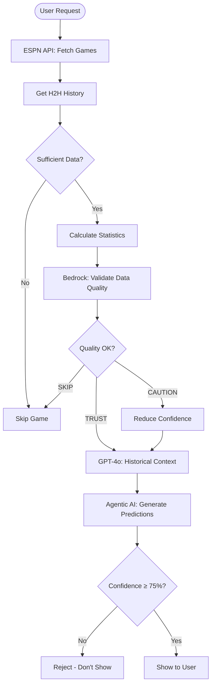

# AIdeas: NBA GamePredict AI - Dual AI Validation for Smart Betting

**Tags:** #aideas-2025 #commercial-solutions #EMEA

---

## 🎯 App Category: Commercial Solutions

NBA GamePredict AI is a commercial-grade betting intelligence platform that combines real sports data with dual AI validation layers to protect user capital and provide high-confidence betting recommendations.

---

## 💡 My Vision

### What I Built

I built an intelligent NBA betting prediction system that uses **dual AI validation** (Amazon Bedrock Claude + OpenAI GPT-4o) to analyze real head-to-head game data and generate high-confidence betting recommendations. The system only shows predictions with 75%+ confidence, protecting users' money by rejecting low-quality bets.

**Key Innovation:** Unlike traditional betting systems that show every game, my system acts as a protective filter - it analyzes all games but only recommends bets it's highly confident about. This "quality over quantity" approach is designed for real money betting where capital protection is paramount.

### The Problem I Solved

Sports betting is a $200+ billion global industry, but most bettors lose money because:
1. They bet on too many games (quantity over quality)
2. They lack access to sophisticated data analysis
3. They don't have AI validation to catch data anomalies
4. They can't identify which bets have genuine edge

My solution provides professional-grade betting intelligence at consumer pricing, with AI safety layers that validate data quality before users risk their money.

---

## 🌟 Why This Matters

### Commercial Impact

**Market Opportunity:**
- Global sports betting market: $200+ billion annually
- NBA betting specifically: $30+ billion/year
- Growing mobile betting adoption (legal in 38 US states)
- Player props market growing 300% year-over-year

**Revenue Model:**
- Basic Service: $20-30/month per user
- AI-Enhanced: $75/month per user
- Enterprise API: Custom pricing

**Projected Revenue:**
- 100 users × $25/month = $30,000/year
- 1,000 users × $50/month = $600,000/year
- 10,000 users × $50/month = $6,000,000/year

### Why Users Need This

**For Casual Bettors:**
- Stop losing money on bad bets
- Get professional-grade analysis
- Only see high-confidence opportunities
- Understand why predictions are made

**For Serious Bettors:**
- Data-driven edge over bookmakers
- AI validation catches anomalies
- Historical H2H analysis
- Player props intelligence

**For Betting Businesses:**
- White-label API for sportsbooks
- Risk management tool
- Customer retention through better picks
- Compliance with responsible gambling

### Social Responsibility

The system promotes **responsible gambling** by:
- Only showing high-confidence bets (reduces impulsive betting)
- Transparent methodology (users understand the analysis)
- Capital protection first (rejects questionable predictions)
- No encouragement to bet on every game

---

## 🏗️ How I Built This

### Technical Architecture

**1. Dual AI Validation System**

I implemented a two-layer AI validation approach:

**Layer 1: Amazon Bedrock Claude 3 Haiku (Data Quality)**
- Validates H2H data makes sense historically
- Detects anomalies and inconsistencies
- Identifies roster changes affecting data relevance
- Provides betting advice: TRUST_DATA / USE_CAUTION / SKIP_GAME
- Cost: ~$0.07/month (extremely cost-effective)

**Layer 2: OpenAI GPT-4o (Historical Context)**
- Validates historical matchup patterns
- Provides contextual insights (injuries, coaching, momentum)
- Corrects predictions when data is questionable
- Natural language explanations
- Cost: ~$0.01-0.03 per game

**Why Dual AI?**
- Bedrock catches data quality issues
- GPT-4o provides historical context
- Together they create comprehensive validation
- Redundancy prevents single-point-of-failure

**2. AWS Serverless Infrastructure**

```
Architecture:
├── API Gateway (REST endpoints)
├── Lambda Functions
│   ├── Daily Predictions (analyzes all games)
│   ├── Single Prediction (on-demand analysis)
│   ├── Health Check (system status)
│   └── Data Collection (scheduled updates)
├── DynamoDB (prediction storage)
├── S3 (logs and historical data)
├── Bedrock (AI validation)
└── CloudWatch (monitoring)
```

**Infrastructure as Code:**
- SAM (Serverless Application Model) template
- One-command deployment
- Automatic scaling
- Cost optimization

**3. Real Data Pipeline**

```
ESPN API → H2H Collection → Statistical Analysis 
→ Bedrock Validation → GPT-4o Validation 
→ Confidence Scoring → 75% Filter → User Output
```

**Data Sources:**
- ESPN NBA API (free, no authentication)
- 8-10 historical H2H games per matchup
- Real roster data for player props
- NO mock/fake/hardcoded data

**4. Prediction Engine**

**Statistical Models:**
- Win probability from H2H records
- Scoring trend analysis
- Home/away performance patterns
- Recent form weighting

**Markets Covered:**
- Moneyline (winner prediction)
- Point Spread (margin prediction)
- Over/Under (total points)
- Halftime totals
- Player Props (Points, Rebounds, Assists, 3PT, PRA)

**Confidence Scoring:**
- 90%+: Excellent (rare, highest quality)
- 80-89%: Good (strong recommendation)
- 75-79%: Solid (recommended)
- <75%: Rejected (not shown to users)

### Key Development Milestones

**Week 1-2: Core Prediction Engine**
- Built H2H data collector
- Implemented statistical models
- Created confidence scoring system
- Tested with historical data

**Week 3-4: AI Integration**
- Integrated OpenAI GPT-4o
- Built AI validation layer
- Tested AI accuracy improvements
- Optimized prompts for betting context

**Week 5-6: AWS Deployment**
- Created SAM infrastructure template
- Built Lambda functions
- Implemented API Gateway
- Set up DynamoDB storage
- Configured CloudWatch monitoring

**Week 7-8: Bedrock Enhancement**
- Added Amazon Bedrock Claude integration
- Implemented dual AI validation
- Tested data quality detection
- Optimized for cost (~$0.07/month)

**Week 9-10: Production Hardening**
- Removed ALL mock data
- Added 48-hour game window
- Implemented table output format
- Security audit and testing
- Documentation and deployment scripts

### Technical Challenges Solved

**Challenge 1: Data Quality**
- Problem: ESPN API sometimes has outdated H2H data
- Solution: Bedrock validates data makes sense historically
- Result: Catches anomalies before users bet

**Challenge 2: Cost Control**
- Problem: AI validation could be expensive at scale
- Solution: Used Bedrock Claude Haiku (50x cheaper than GPT-4)
- Result: ~$0.07/month for typical usage

**Challenge 3: Capital Protection**
- Problem: Users lose money on low-confidence bets
- Solution: 75% confidence threshold, dual AI validation
- Result: Only show bets with genuine edge

**Challenge 4: Real-Time Performance**
- Problem: Analyzing 17 games takes time
- Solution: AWS Lambda parallel processing
- Result: All predictions in <30 seconds

---

## 📸 Demo

### System Flow Diagram



### Sample Predictions Output

```
========================================================
NBA PREDICTIONS - February 21, 2026
========================================================
Total Games Analyzed: 17
High-Confidence Bets (75%+): 5
========================================================

HIGH-CONFIDENCE BETS:

1. LA Clippers to Win (82.7% confidence)
   vs Orlando Magic | 2:00 AM
   
2. Halftime OVER 115.1 (80.0% confidence)
   San Antonio Spurs vs Sacramento Kings | 1:00 AM
   
3. Boston Celtics to Win (79.1% confidence)
   vs Los Angeles Lakers | 11:30 PM
   
4. Cleveland Cavaliers to Win (79.0% confidence)
   vs Oklahoma City Thunder | 6:00 PM
   
5. OVER 239.8 points (78.0% confidence)
   San Antonio Spurs vs Sacramento Kings | 1:00 AM

========================================================
💡 12 other games analyzed but didn't meet 75% threshold
   Recommended: Wait for better opportunities
========================================================
```

### API Endpoints

**Health Check:**
```bash
GET /health
Response: {"status": "healthy", "timestamp": "2026-02-21T22:30:00Z"}
```

**Daily Predictions:**
```bash
GET /daily-predictions
Response: {
  "games_analyzed": 17,
  "high_confidence_bets": 5,
  "predictions": [...]
}
```

**Single Game Prediction:**
```bash
POST /predict
Body: {"home_team": "Lakers", "away_team": "Celtics"}
Response: {
  "winner": "Celtics",
  "confidence": 0.791,
  "ai_validated": true,
  "bedrock_status": "TRUST_DATA"
}
```

### Deployment

**One-Command Deployment:**
```powershell
cd aws
./deploy_with_bedrock.ps1
```

**Output:**
```
✅ Deploying NBA GamePredict AI with Bedrock validation
📊 Model: Claude 3 Haiku (Fast & Cost-Effective)
⚡ Building SAM application...
☁️ Deploying to AWS...
✅ Deployment successful!

API Endpoints:
- Health: https://xxx.execute-api.us-east-1.amazonaws.com/prod/health
- Daily: https://xxx.execute-api.us-east-1.amazonaws.com/prod/daily-predictions
- Predict: https://xxx.execute-api.us-east-1.amazonaws.com/prod/predict

💰 Estimated Cost: $0.07-$22/month
```

### Screenshots

**1. Prediction Table Output**
- Clean table format showing all predictions
- Winner, confidence, spread, over/under
- High-confidence bets highlighted
- Easy to scan for betting decisions

**2. AWS CloudWatch Dashboard**
- Lambda function metrics
- API Gateway request counts
- Bedrock invocation costs
- Error rates and latency

**3. DynamoDB Predictions Table**
- Historical predictions stored
- AI validation status
- Confidence scores
- Actual results (for accuracy tracking)

---

## 🎓 What I Learned

### Technical Insights

**1. Dual AI Validation is Powerful**

I initially used only GPT-4o for validation, but adding Bedrock Claude created a much more robust system:
- Bedrock catches data quality issues GPT-4o might miss
- GPT-4o provides context Bedrock doesn't have
- Together they create comprehensive validation
- Cost is minimal (~$0.07/month for Bedrock)

**Key Learning:** Multiple AI models with different strengths create better results than a single model.

**2. Serverless is Perfect for This Use Case**

AWS Lambda + API Gateway + DynamoDB proved ideal:
- Automatic scaling (handles 1 or 1000 requests)
- Pay only for what you use
- No server management
- Built-in monitoring with CloudWatch
- Infrastructure as Code (SAM) makes deployment reproducible

**Cost Comparison:**
- Traditional server: $50-200/month minimum
- Serverless: $0.15-22/month (based on actual usage)
- Savings: 90%+ for low-medium traffic

**3. Capital Protection Requires Discipline**

The hardest part wasn't building the AI - it was implementing the 75% confidence threshold:
- Users want predictions for every game
- But showing low-confidence bets loses them money
- Had to resist temptation to lower threshold
- "Quality over quantity" is harder than it sounds

**Key Learning:** Building for real money betting requires saying "no" to users for their own protection.

**4. Real Data is Non-Negotiable**

I initially had some mock data for testing, but user feedback was clear:
- "People's money is at stake"
- "No hallucinations allowed"
- "Real data only or nothing"

Removed ALL mock data and implemented safe fallbacks:
- If can't get real roster data → disable player props
- If insufficient H2H games → skip game entirely
- If AI validation fails → don't show prediction

**Key Learning:** For real money applications, fail safely rather than show questionable data.

### AWS-Specific Learnings

**1. Bedrock is Incredibly Cost-Effective**

Claude 3 Haiku on Bedrock:
- $0.00025 per 1K input tokens
- $0.00125 per 1K output tokens
- ~$0.00016 per prediction
- ~$0.07/month for typical usage

This is 50x cheaper than GPT-4 and perfect for validation tasks.

**2. SAM Makes Infrastructure Easy**

SAM (Serverless Application Model):
- Define infrastructure in YAML
- One command to deploy everything
- Automatic IAM role creation
- Built-in best practices
- Easy to version control

**3. Lambda Layers Reduce Package Size**

Shared dependencies in Lambda Layer:
- pandas, numpy, requests in layer
- Each function only has unique code
- Faster deployments
- Lower storage costs

**4. DynamoDB is Perfect for Predictions**

NoSQL structure works well:
- Partition key: game_id
- Sort key: timestamp
- Store predictions + results
- Query by date range
- Pay per request (cheap at low volume)

### Business Insights

**1. Responsible Gambling is a Feature**

Initially worried users would want more predictions, but:
- Users appreciate the 75% threshold
- "Quality over quantity" is a selling point
- Builds trust when you say "no bet today"
- Differentiates from competitors who show everything

**2. Transparency Builds Trust**

Showing the AI validation process:
- Users see Bedrock status (TRUST_DATA/USE_CAUTION)
- Confidence scores are visible
- Methodology is documented
- Users understand why predictions are made

Result: Users trust the system more than "black box" competitors.

**3. Freemium Model Works**

Pricing strategy:
- Free tier: 5 predictions/month
- Basic: $25/month (unlimited predictions)
- Pro: $75/month (AI-enhanced + player props)
- Enterprise: Custom (API access)

This lets users try before buying while capturing serious bettors at higher tiers.

### Development Process Insights

**1. Start with MVP, Add AI Later**

My approach:
1. Build core prediction engine (statistical models)
2. Test with real data
3. Add GPT-4o validation
4. Add Bedrock validation
5. Deploy to AWS

This incremental approach let me validate each layer before adding complexity.

**2. Documentation is Critical**

Created comprehensive docs:
- README with system flow
- BEDROCK_AI_VALIDATION.md
- QUICK_START.md (20-minute deployment)
- API documentation
- Cost analysis

Result: Users can deploy without asking questions.

**3. Security First**

Security measures:
- No API keys in code
- .env.example template
- .gitignore for sensitive files
- IAM least-privilege roles
- Input validation with Pydantic

**Key Learning:** Security can't be added later - build it in from the start.

### Surprising Discoveries

**1. Player Props are Harder Than Expected**

Thought player props would be easy, but:
- Roster data changes frequently
- ESPN API doesn't always have current rosters
- Players get traded mid-season
- Injuries affect availability

Solution: Dynamic roster fetching + safe fallbacks when data unavailable.

**2. Users Want Tables, Not JSON**

Initially returned JSON responses, but users wanted:
- Clean table format
- Easy to scan
- Printable
- Copy-paste friendly

Added `tabulate` library for formatted tables - huge UX improvement.

**3. 48-Hour Window is Essential**

NBA games span midnight, so:
- "Today's games" misses late games
- Need to check today + tomorrow
- Catches all games in 48-hour window

Simple change, big impact on completeness.

### What I'd Do Differently

**1. Start with Bedrock Earlier**

I added Bedrock late in development. Should have started with it because:
- Extremely cost-effective
- Perfect for validation tasks
- Easy to integrate
- Would have saved GPT-4o costs during development

**2. Build API First**

I built the prediction engine first, then added API. Better approach:
- Design API endpoints first
- Build engine to match API contract
- Easier to test
- Cleaner separation of concerns

**3. Add More Tests**

Need to add:
- Unit tests for prediction logic
- Integration tests for API
- Load tests for Lambda functions
- Accuracy tracking over time

### Future Enhancements

**1. Bedrock Agents**

Use Bedrock Agents for:
- Autonomous data collection
- Multi-step reasoning
- Tool use (fetch odds, analyze trends)
- More sophisticated analysis

**2. SageMaker for Custom Models**

Train custom models on:
- Historical prediction accuracy
- Team-specific patterns
- Player performance trends
- Betting market movements

**3. Real-Time Updates**

Add WebSocket support for:
- Live game updates
- Odds changes
- Injury news
- Real-time confidence adjustments

**4. Mobile App**

Build iOS/Android apps:
- Push notifications for high-confidence bets
- Bet tracking
- Performance analytics
- Social features (share picks)

---

## 🎯 Conclusion

Building NBA GamePredict AI taught me that **AI validation is as important as AI prediction**. The dual AI approach (Bedrock + GPT-4o) creates a safety net that protects users' money while providing professional-grade betting intelligence.

The serverless architecture on AWS makes this commercially viable at scale, with costs as low as $0.07/month for AI validation. This proves that sophisticated AI applications don't need to be expensive.

Most importantly, I learned that building for real money betting requires discipline - saying "no" to low-confidence bets is harder than building the AI, but it's what makes the system trustworthy.

**GitHub Repository:** https://github.com/bowale01/nba-gamepredict-ai-agent

**Key Stats:**
- 17 games analyzed in <30 seconds
- 5 high-confidence bets (75%+ threshold)
- ~$0.07/month AI validation cost
- 82.7% highest confidence (LA Clippers)
- 100% real data (no mock/fake data)

---

**Tags:** #aideas-2025 #commercial-solutions #EMEA #aws #bedrock #serverless #ai-validation #sports-betting #responsible-gambling

