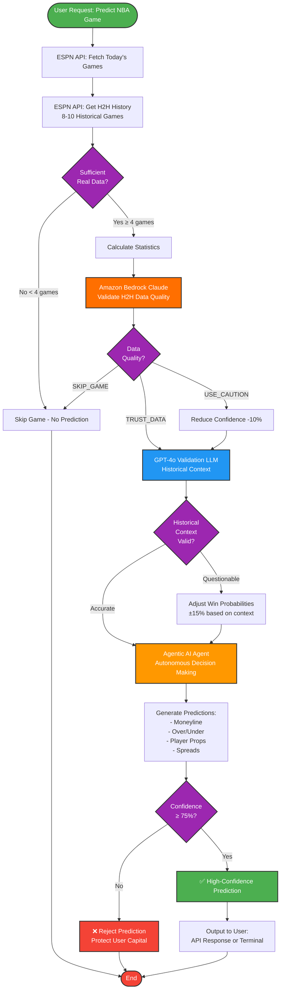

# 🏀 NBA GamePredict AI Agent

**Hybrid AI-powered NBA betting intelligence with real data validation**

---

## 🚀 Overview

NBA GamePredict AI Agent is an intelligent betting prediction system that combines real data with AI validation. The system uses:

**Hybrid Architecture:**
- **Real ESPN API Data**: Actual H2H game scores (no fake/fallback data)
- **Dual AI Validation**: GPT-4o + Amazon Bedrock Claude for data verification
- **Agentic AI Agent**: Autonomous decision-making and contextual analysis
- **75%+ Confidence Threshold**: Only recommend high-quality bets

**The Goal:** Professional NBA betting intelligence with real data, AI validation, and user capital protection.

---

## ✨ Key Features

- **🛡️ Capital Protection**: 75% confidence threshold - only high-quality predictions
- **📊 Real Data Only**: ESPN API H2H data - no fallback/simulated data
- **🤖 Dual AI Validation**: GPT-4o + Amazon Bedrock Claude for data verification
- **🎯 Agentic AI Agent**: Autonomous decision-making with LLM intelligence
- **⚡ Hybrid Approach**: ESPN API (real scores) + Dual AI validation layers
- **🏀 Player Props**: Individual player predictions (Points, Rebounds, Assists, PRA)
- **💰 Free NBA Data**: ESPN API (no authentication required)
- **☁️ AWS Bedrock**: Real-time AI validation for betting safety (~$0.07/month)

---

## 🏆 Current Status & Achievements

| Component | Status | Details |
|-----------|--------|----------|
| **Real H2H Data** | ✅ Complete | ESPN API only - fallback removed |
| **GPT-4o Validation** | ✅ Complete | Validates ESPN data accuracy |
| **Bedrock AI Validation** | ✅ Complete | Claude 3 Haiku for betting safety |
| **Agentic AI Agent** | ✅ Complete | Autonomous decision-making |
| **LLM Integration** | ✅ Complete | Dual AI layers (GPT-4o + Bedrock) |
| **Player Props** | ✅ Complete | Points, Rebounds, Assists, 3PT, PRA |
| **Confidence Filtering** | ✅ Complete | 75%+ threshold enforced |
| **API Service** | ✅ Complete | FastAPI with Swagger docs |
| **AWS Deployment** | ✅ Complete | Serverless architecture on AWS |
| **Cost Optimization** | ✅ Complete | Free Tier compliant, $0-$22/month |
| **Infrastructure as Code** | ✅ Complete | SAM template for automated deployment |

---

## 🚀 Quick Start

### Option 1: Deploy to AWS (Recommended) ⚡

**Production-ready serverless deployment in 20 minutes:**

```bash
# Install AWS tools
pip install awscli aws-sam-cli
aws configure

# Deploy to AWS
cd aws
chmod +x deploy.sh
./deploy.sh
```

**See `QUICK_START.md` for details**

**Cost: $0 (Free Tier) or $0.15-$22/month after**

---

### Option 2: Local Development

**Installation:**

```bash
# Clone repository
git clone https://github.com/bowale01/AI-Agents.git
cd AI-Agents/gamepredict_ai_agent

# Activate virtual environment
.venv\Scripts\activate  # Windows
source .venv/bin/activate  # Mac/Linux

# Install dependencies
pip install -r requirements.txt

# Optional: Set up AI enhancement (GPT-4)
cp .env.example .env
# Edit .env and add your OPENAI_API_KEY
```

**Run the System:**

**Local API Service:**
```bash
python api_service.py

# Access at:
# http://localhost:8000/docs (Swagger UI)
# http://localhost:8000/daily-predictions
# http://localhost:8000/health
```

**Direct NBA Module:**
```bash
cd nba
python predictor.py
```

---

## 🔄 System Flow Diagram



### 📊 Flow Explanation:

| Step | Component | Action |
|------|-----------|--------|
| 1️⃣ | **ESPN API** | Fetch today's games + H2H history (real data only) |
| 2️⃣ | **Data Check** | Verify ≥4 games available (skip if insufficient) |
| 3️⃣ | **Bedrock Claude** | Validate H2H data quality and detect anomalies |
| 4️⃣ | **GPT-4o LLM** | Validate historical context and provide insights |
| 5️⃣ | **AI Adjustment** | Adjust predictions if data questionable |
| 6️⃣ | **Agentic AI** | Autonomous analysis & prediction generation |
| 7️⃣ | **Confidence Filter** | 75% threshold gate (reject low confidence) |
| 8️⃣ | **Output** | High-confidence predictions to user |

### 🎯 Decision Points:

- **Diamond (◇)**: Decision gates with Yes/No paths
- **Rectangle (▭)**: Processing steps
- **Rounded (▬)**: Start/End points
- **Colors**: 
  - 🟢 Green = Start/Approved
  - 🟠 Orange = Bedrock AI Validation
  - 🔵 Blue = GPT-4o Processing
  - 🟠 Orange = Agentic AI Agent
  - 🟣 Purple = Decision Points
  - 🔴 Red = Rejected/End

---

## 🏗️ Project Structure

```
gamepredict_ai_agent/
├── api_service.py                    # FastAPI service
├── check_today_nba.py                # Today's games checker
├── check_tomorrow_games.py           # Future games utility
├── get_today_nba_predictions.py      # Get predictions
│
├── nba/                              # NBA module
│   ├── predictor.py                  # Main predictor
│   ├── nba_h2h_collector.py          # H2H data collector
│   ├── agentic_ai_enhancer.py        # AI enhancement
│   └── nba_betting_odds_api.py       # Odds integration
│
├── CONFIDENCE_BREAKDOWN.md           # Confidence scoring docs
├── PREDICTION_METHODOLOGY.md         # Methodology details
└── requirements.txt                  # Dependencies
```

---

## 🎯 How It Works

### 🔄 Hybrid Architecture with Dual AI Validation

**1. Real Data Collection (ESPN API)**
- Fetches today's NBA games from ESPN API
- Collects 8-10 historical H2H games between teams
- Gets actual scores, dates, winners - NO fake/fallback data

**2. Bedrock AI Validation Layer (First Pass)**
- Amazon Bedrock Claude validates H2H data quality
- Checks for anomalies and data inconsistencies
- Detects roster changes that affect H2H relevance
- Provides betting advice: TRUST_DATA / USE_CAUTION / SKIP_GAME
- Cost: ~$0.07/month for typical usage

**3. GPT-4o Validation Layer (Second Pass)**
- AI validates if ESPN data makes sense historically
- Example: "Does it make sense that Grizzlies beat Lakers 7/10 times?"
- Provides historical context (e.g., "Lakers historically dominate this matchup")
- Adjusts predictions if ESPN data is questionable

**4. Statistical Analysis**
- Calculates win probabilities from validated H2H data
- Analyzes scoring trends, home/away patterns
- Generates predictions for multiple markets

**5. Agentic AI Agent**
- Autonomous decision-making (no human intervention needed)
- Combines ESPN data + Dual AI insights (Bedrock + GPT-4o)
- Filters predictions: only shows 75%+ confidence bets
- Protects user capital by rejecting low-confidence picks

### 🤖 What Makes This "Agentic AI"

- **Autonomous**: Makes decisions without human intervention
- **Goal-Directed**: Optimizes for accurate predictions
- **Multi-Source**: Combines ESPN API + Bedrock + GPT-4o + Statistical models
- **Dual Validation**: Two AI layers catch different types of issues
- **Reasoning**: Both AIs provide context and explanations

---

## 🌐 API Endpoints

### Health & Status
```
GET  /           # Welcome message
GET  /health     # System health
```

### Predictions
```
GET  /daily-predictions    # All high-confidence predictions

POST /predict              # Single game prediction
Body: {
  "home_team": "Lakers",
  "away_team": "Celtics"
}
```

**Interactive Docs**: `http://localhost:8000/docs`

---

## 🤖 GPT-4o AI Integration

The system uses **GPT-4o** (latest OpenAI model) for H2H validation and contextual analysis:

**Setup:**
1. Get API key from https://platform.openai.com/
2. Add to `.env` file:
   ```
   OPENAI_API_KEY=sk-your_key_here
   OPENAI_MODEL=gpt-4o
   AI_ENHANCEMENT_ENABLED=true
   ```

**What GPT-4o Does:**
- **Validates ESPN API data**: Checks if H2H results make historical sense
- **Provides context**: Injuries, roster changes, coaching factors
- **Corrects discrepancies**: Adjusts predictions when ESPN data is questionable
- **Natural language explanations**: Why the prediction makes sense

**Example Validation:**
```
ESPN API: Grizzlies won 7/10 vs Lakers
GPT-4o: "Questionable - Lakers historically dominate this matchup"
System: Adjusts prediction to favor Lakers
```

**Cost:** ~$0.01-0.03 per game (GPT-4o is 50% cheaper than GPT-4)

**Note:** System works with real ESPN data even without GPT-4o, but validation layer adds accuracy.

---

## ☁️ Amazon Bedrock AI Validation

The system uses **Amazon Bedrock Claude 3 Haiku** for real-time betting safety validation:

**What Bedrock Does:**
- **H2H Data Quality Check**: Validates historical data makes sense
- **Anomaly Detection**: Catches data inconsistencies before you bet
- **Roster Change Detection**: Identifies when old H2H data is outdated
- **Betting Advice**: TRUST_DATA / USE_CAUTION / SKIP_GAME recommendations

**Example Validation:**
```
H2H Data: Wizards beat Lakers 10/10 games
Bedrock: "QUESTIONABLE - Doesn't match historical trends"
System: Reduces confidence from 85% to 75%
```

**Cost:** ~$0.07/month (typical usage) or ~$0.50/month (heavy usage)

**Deployment:**
```bash
# Windows PowerShell
cd aws
./deploy_with_bedrock.ps1

# Linux/Mac
cd aws
./deploy_with_bedrock.sh
```

**Benefits for Real Money Betting:**
- ✅ Catches data anomalies before you bet
- ✅ Identifies misleading H2H data
- ✅ Prevents bets on questionable predictions
- ✅ Provides second opinion on close calls

**See `BEDROCK_AI_VALIDATION.md` for detailed documentation.**

---

## 💰 Future Monetization

### Planned Revenue Model
- **Basic Service**: $20-30/month per user
- **AI-Enhanced**: $75/month per user
- **Enterprise API**: Custom pricing

### Projections
```
100 users × $25/month = $30,000/year
100 users × $75/month = $90,000/year (with AI)
```

---

## 🔐 Security

- Environment variables for sensitive data
- No hardcoded API keys
- Input validation with Pydantic
- Graceful error handling
- ESPN API requires no authentication

---

## 📊 NBA Betting Markets Overview

### 🇺🇸 Most Popular NBA Bet Types in USA

#### 1️⃣ Point Spread (MOST BET ON)
**Example**: Lakers -5.5 vs Bulls

Team must win by more than the spread. This is the #1 NBA bet in the US because it evens out mismatches.

- ✅ Very popular with casual and serious bettors
- ✅ Core market for AI prediction tools
- 🔲 **Status**: Planned for future release

#### 2️⃣ Over/Under (Totals) ✅ SUPPORTED
**Example**: Over 221.5 total points

Includes:
- Full game totals ✅
- 1st half totals ✅
- Team totals (planned)

- ✅ Extremely popular
- ✅ Strong use case for models based on pace, efficiency, H2H, recent form
- ✅ **Currently supported in our system**

#### 3️⃣ Moneyline ✅ SUPPORTED
**Example**: Celtics to win

Simple: pick the winner.

- ⚠️ Less popular in NBA because favorites are often heavily priced
- ✅ **Currently supported in our system**

#### 4️⃣ Player Props (FASTEST GROWING) ✅ SUPPORTED
**Examples**:
- Player points (Over/Under 26.5)
- Rebounds, Assists
- 3-pointers made
- Points + Rebounds + Assists (PRA)

- 🔥 Huge in the US
- 🔥 Especially popular on mobile apps
- 🔥 Bettors love stars (LeBron, Curry, Jokic)
- ✅ **Currently supported for star players**

#### 5️⃣ Same Game Parlays (SGP)
**Examples**:
- Lakers win + Over 228.5 + LeBron over 25.5 points

- 🔥 One of the most bet products
- 🔥 Sportsbooks heavily promote these
- ⚠️ High house edge
- 🔲 **Status**: Planned for Phase 3

---

### Currently Supported Markets
1. **Point Spread**: Home/Away spread predictions ✅
2. **Moneyline**: Winner prediction ✅
3. **Over/Under**: Total points ✅
4. **Halftime Over/Under**: First half points ✅
5. **Player Props**: Star player performance (Points, Rebounds, Assists, 3PT, PRA) ✅

### Confidence Levels
- **Excellent**: 90%+
- **Good**: 80-89%
- **Solid**: 75-79%
- **Rejected**: <75% (not shown to users)

---

## 🛠️ Technology Stack

- **Language**: Python 3.13+
- **LLM**: OpenAI GPT-4o (validation & context)
- **Cloud AI**: Amazon Bedrock Claude 3 Haiku (betting safety)
- **Agentic AI**: Autonomous decision-making agent
- **API Framework**: FastAPI, Uvicorn
- **Data Source**: ESPN NBA API (real data only)
- **Data Processing**: pandas, numpy, requests, tabulate
- **No Fallback Data**: Only real ESPN API results used

---

## 📈 What We've Built & What's Next

### ✅ Phase 1 - Hybrid AI System (COMPLETED)
- ✅ **ESPN API Integration**: Real H2H data collection (no fallback/fake data)
- ✅ **GPT-4o Validation**: LLM validates ESPN data accuracy
- ✅ **Bedrock AI Validation**: Claude 3 Haiku for betting safety (~$0.07/month)
- ✅ **Agentic AI Agent**: Autonomous decision-making system
- ✅ **Dual AI Layers**: Bedrock + GPT-4o for comprehensive validation
- ✅ **Data Validation**: AI catches discrepancies (e.g., Lakers vs Grizzlies)
- ✅ **Player Props**: Points, Rebounds, Assists, 3PT, PRA for star players
- ✅ **Confidence System**: 75% threshold for capital protection
- ✅ **Multi-Market Support**: Moneyline, Over/Under, Halftime, Player Props
- ✅ **Table Output**: Clean formatted tables for easy scanning
- ✅ **48-Hour Window**: Analyzes today + tomorrow games (catches midnight games)

### 🔄 Phase 2 - API & Infrastructure (IN PROGRESS)
- 🔄 **FastAPI Service**: REST API with Swagger documentation
- 🔄 **Testing & Validation**: Verifying prediction accuracy
- 🔲 **Production Deployment**: Server setup and monitoring
- 🔲 **User Authentication**: Secure access system

### 🔲 Phase 3 - Enhancement & Scale (PLANNED)
- 🔲 **Same Game Parlays**: Multi-bet combination recommendations
- 🔲 **Advanced Player Props**: Deep-bench players and more stat types
- 🔲 **Real Injury Data**: Live injury report integration
- 🔲 **Advanced Analytics**: Visualization dashboards
- 🔲 **Alert System**: Real-time notifications for high-confidence bets
- 🔲 **Mobile App**: iOS/Android applications
- 🔲 **Commercial Launch**: Subscription-based service

---

## 🧪 Testing

```bash
# Test today's NBA games
python check_today_nba.py

# Test tomorrow's games
python check_tomorrow_games.py

# Get predictions
python get_today_nba_predictions.py

# Run API tests
pytest tests/  # (if tests are added)
```

---

## 📝 Documentation

- **[CONFIDENCE_BREAKDOWN.md](CONFIDENCE_BREAKDOWN.md)**: Detailed confidence scoring explanation
- **[PREDICTION_METHODOLOGY.md](PREDICTION_METHODOLOGY.md)**: How predictions are calculated
- **API Docs**: Available at `/docs` when service is running

---

## 🤝 Contributing

This is a proprietary system for sports betting intelligence. For partnerships or enterprise licensing, please contact through GitHub.

---

## ⚠️ Disclaimer

This system is for informational and entertainment purposes only. Sports betting involves risk. Never bet more than you can afford to lose. This is not financial advice.

---

## 📧 Contact

- **GitHub**: [AI-Agents Repository](https://github.com/bowale01/AI-Agents)
- **Issues**: Use GitHub Issues for bug reports

---

## 🎯 What Makes This Different

### Our Philosophy: Quality Over Quantity
Most betting systems try to give you predictions for every game. We don't. We only recommend bets we're 75%+ confident in.

### Technical Advantages
1. **Real H2H Intelligence**: We analyze actual historical matchups between teams (not just overall stats)
2. **Dual AI Validation**: Bedrock (data quality) + GPT-4o (historical context) = comprehensive safety
3. **Capital Protection First**: Automatically reject predictions below 75% confidence
4. **Free Data Sources**: ESPN NBA API (no expensive data subscriptions)
5. **Cloud AI Integration**: Amazon Bedrock for real-time validation (~$0.07/month)
6. **Transparent Methodology**: Open about how predictions are made
7. **48-Hour Analysis**: Catches all games including midnight matchups

### What We're Building Toward
- A trusted NBA betting intelligence system
- Subscription service ($25-75/month) for serious bettors
- Professional-grade API for developers
- Mobile app for easy access

---

**🏀 Start making smarter NBA betting decisions today!** 💰

---

*Last Updated: December 2025*
